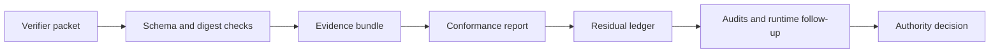

# verification-ecology-kit

`verification-ecology-kit` is a stable operational toolkit for VET-style
records, schemas, residual ledgers, conformance reports, packet operations, and
audits.

It is built for a simple problem: verification work often produces more than
one word of output. A result can pass, fail, need more evidence, depend on a
stale source, hide an unresolved boundary, or be usable for research but not
safe for deployment. This package gives those differences a structured form.

It is not a complete formal semantics or theorem prover for Verifier Ecology
Theory. It is a practical Python and JSON implementation for recording,
checking, and auditing verification evidence.

It helps you answer practical questions such as:

- What exactly was checked?
- What evidence was used?
- What is still unresolved?
- Which result is allowed to be reused, shared, or deployed?
- Did a file, JSON object, reference, or digest change after it was checked?
- Are failures being recorded, or are they being hidden behind a single
  "passed" label?

The project is based on **Verifier Ecology Theory** by K. Takahashi:
https://doi.org/10.5281/zenodo.21147093

The theory uses precise terms. This package turns many of those terms into
ordinary software objects: JSON records, Python classes, command line checks,
schemas, audit reports, and release gates.

## Who This Is For

Use this project if you need verification claims to leave an inspectable trail.
Typical users include:

- researchers recording how a claim was checked
- engineers reviewing JSON records, schemas, digests, or evidence bundles
- safety and quality teams tracking unresolved issues across review steps
- tool builders who need reusable records for checks, residuals, authority
  decisions, and audit reports
- release maintainers who want local gates before publishing a package

The package is also useful when different teams or tools need to agree on what
was checked, what remains open, and what a result is allowed to support.

## What This Package Does

Use this package when you need to record verification work in a form that other
people and other tools can inspect.

It can:

- describe a verifier, check, review step, or evidence source as a structured
  record
- record open issues instead of dropping them after a partial pass
- validate JSON objects against bundled schemas
- compute stable SHA-256 digests for JSON files
- check whether references and digests still match
- run conformance checks over a bundle of related objects
- keep an append-only ledger of unresolved work
- make authority decisions explicit, such as "usable as evidence" versus
  "allowed for deployment"
- run local audits for stale evidence, hidden failures, missing counter-checks,
  schema overclosure, monoculture risk, and local information leakage
- build and smoke-test the Python package before release

It is useful for research tooling, safety review, software quality assurance,
schema-based workflows, release checks, and projects where verification claims
need a visible paper trail.

## Inputs And Outputs

Most workflows use plain files.

| You provide | The package produces |
| --- | --- |
| JSON records | schema validation results |
| JSON objects or files | stable SHA-256 digests |
| verifier packets | packet validation reports and residual obligations |
| bundles of related evidence | conformance reports |
| residual ledgers | trace and liveness checks |
| packet populations or runtime state | runtime reports and generated follow-up packets |
| repository paths | secret, local information, and package-content scan reports |

The output is designed to be machine-readable first and human-readable when
requested, so it can be used in local scripts, CI, review notes, or research
artifacts.

## What This Package Does Not Do

This is not a theorem prover and does not claim to prove every property in the
paper.

It does not replace human review, domain expertise, model checking, formal
proof, fuzzing, or security testing. It gives those activities a shared record
format and a set of checks so that results, limits, and remaining work are not
lost.

In short:

- it records and checks verification evidence
- it keeps unfinished work visible
- it helps decide whether evidence can be reused
- it does not prove by itself that a system is correct

## Semantic Completeness Boundary

Verifier Ecology Theory is broader than this software package. The package
implements an operational subset: records, schema contracts, reference and
digest checks, residual accounting, support-aware authority checks, packet
operation checks, runtime reports, and local audits.

That means:

- `JValid` is reconstructed from available contract, context, subject, and
  digest material when conformance data contains enough information.
- Authority is derived from explicit support evidence and is deny-by-default.
- Residual ledgers are replay checked so tampered event digests are rejected.
- Runtime checks report structured stages instead of unlabeled strings.
- Packet operations preserve or residualize origin, residual, boundary, and
  counter-packet obligations.

It does not mean:

- every theorem in the paper is mechanically proved
- every possible verifier ecology can be fully modeled
- external evidence is trusted without records, digests, and status checks
- an `allow` label is enough to authorize use without support evidence

When the package cannot decide a claim, it should preserve the issue as a
residual rather than silently treating the claim as closed.

## Start Here

Choose the path that matches what you want to do.

| If you want to... | Start with |
| --- | --- |
| Try the tool quickly | [Try It In 5 Minutes](#try-it-in-5-minutes) |
| Learn the main ideas without theory jargon | [Core Ideas In Plain Words](#core-ideas-in-plain-words) |
| Use the command line | [Command Line Overview](#command-line-overview) and [docs/cli.md](docs/cli.md) |
| Use the Python API | [Python Example](#python-example) and [docs/api.md](docs/api.md) |
| Validate JSON records | [docs/schemas.md](docs/schemas.md) |
| Check a bundle of related records | [docs/conformance.md](docs/conformance.md) |
| Track unresolved work | [Track Open Work](#3-track-open-work) |
| Run audits | [docs/audits.md](docs/audits.md) |
| Understand the theory mapping | [docs/theory_mapping.md](docs/theory_mapping.md) and [docs/v1_audit.md](docs/v1_audit.md) |
| Review release readiness | [docs/v1_readiness.md](docs/v1_readiness.md), [docs/release_readiness.md](docs/release_readiness.md), and [docs/release_gates.md](docs/release_gates.md) |
| Check security posture | [SECURITY.md](SECURITY.md) and [docs/security.md](docs/security.md) |

Recommended reading order for a first pass:

1. Read [Core Ideas In Plain Words](#core-ideas-in-plain-words).
2. Run [Try It In 5 Minutes](#try-it-in-5-minutes).
3. Open [docs/quickstart.md](docs/quickstart.md) for a complete walkthrough.
4. Use [docs/cli.md](docs/cli.md) or [docs/api.md](docs/api.md) depending on
   whether you want shell commands or Python code.
5. Check [docs/v1_audit.md](docs/v1_audit.md) when you need to know which
   theory-facing claims are implemented as full objects, operational checks,
   partial semantic checks, or residualized interfaces.

## Core Ideas In Plain Words

The package uses a few terms from the paper. They are easier to understand if
you map them to everyday review work.

| Term | Plain meaning |
| --- | --- |
| Verifier | Something that checks a claim, file, object, result, or process |
| Verifier packet | A structured record that says what a verifier is, where it came from, what it checks, and what limits it has |
| Residual | Work that is not finished yet, such as a missing check, unknown boundary, exception, warning, or unresolved question |
| Residual ledger | A history of residuals, including when they were added, changed, retired, quarantined, or redacted |
| Conformance report | A step-by-step report saying whether a group of records follows the selected rules |
| Authority gate | A deny-by-default decision layer that says whether evidence may be reused, shared, deployed, or used for repair |
| Bundle | A JSON object that groups packets, ledgers, decisions, references, and related evidence |
| Audit | A focused check for a known failure pattern, such as stale evidence or missing counter-checks |

These words matter because a simple `pass` or `fail` result is often too small
for real review work. A check can pass while still depending on assumptions. A
tool can be useful but too stale for deployment. A record can be valid JSON but
still unsafe to circulate. This package keeps those differences visible.

The main rule is: do not hide unfinished verification work. If something is
unknown, stale, missing, redacted, untranslated, or outside a checked boundary,
record it as a residual and route it for follow-up.

## How The Pieces Fit Together

A common workflow looks like this:

1. Create or receive a verifier packet.
2. Validate the packet against a JSON schema.
3. Compute digests for important JSON objects.
4. Put related objects into a bundle.
5. Run a conformance check on the bundle.
6. Record unresolved work in the residual ledger.
7. Run audits for common failure patterns.
8. Use an authority gate to decide what the evidence is allowed to do.

You can use only one part of the package, such as schema validation or digest
checking, but the full workflow is designed to keep evidence, gaps, and
decisions connected.



## Installation

Install from GitHub:

```bash
pip install git+https://github.com/kadubon/verification-ecology-kit.git
```

When the PyPI package is published, installation is:

```bash
pip install verification-ecology-kit
```

Requirements:

- Python 3.11 or newer
- No network access is required at runtime by default

Check that the command line tool is available:

```bash
vek doctor
```

## Try It In 5 Minutes

Create a basic verifier packet:

```bash
vek packet create --template operational
```

Create a JSON file and compute its digest:

```bash
python -c "from pathlib import Path; Path('object.json').write_text('{\"value\":\"demo\"}\\n', encoding='utf-8')"
vek digest object.json
```

Create a minimal bundle and run a conformance check:

```bash
python -c "from pathlib import Path; Path('bundle.json').write_text('{\"bundle_id\":\"demo\",\"schema_version\":\"1\",\"conformance_profile\":\"core\",\"objects\":[]}\\n', encoding='utf-8')"
vek conformance bundle.json --profile core --format markdown
```

Scan the current repository for obvious secret-like values and local paths:

```bash
vek scan leaks .
vek scan local-info .
```

Next steps:

- read [docs/quickstart.md](docs/quickstart.md) for a short walkthrough
- read [docs/concepts.md](docs/concepts.md) for the main ideas
- run the examples in [examples/](examples/)

## Python Example

```python
from verification_ecology_kit import ResidualLedger, VerifierPacket

packet = VerifierPacket.minimal()
results = packet.validate()

ledger = ResidualLedger()
for residual in packet.residual_obligations:
    ledger.add(residual, justification="packet validation")

print([result.to_dict() for result in results])
print(ledger.trace_ok().to_dict())
```

This creates a minimal verifier packet, validates its accountability fields,
records any open residual work, and checks that the ledger trace is internally
consistent.

For more complete examples, see:

- [examples/basic_packet.py](examples/basic_packet.py)
- [examples/residual_ledger.py](examples/residual_ledger.py)
- [examples/operational_bundle.py](examples/operational_bundle.py)
- [examples/authority_gate.py](examples/authority_gate.py)
- [examples/federated_bundle.py](examples/federated_bundle.py)
- [examples/runtime_loop.py](examples/runtime_loop.py)

## Common Workflows

### 1. Check A JSON Object

```bash
vek validate object.json --schema verifier-packet.schema.json --profile core
```

Use this when you want to confirm that a JSON object matches one of the bundled
schemas.

### 2. Check A Bundle

```bash
vek conformance bundle.json --profile core --format json
```

Use this when you want an ordered report for schema checks, digest checks,
reference checks, residual checks, judgment checks, and authority checks.

### 3. Track Open Work

```python
from verification_ecology_kit import ResidualLedger, ResidualRecord
from verification_ecology_kit.model.records import ResidualKind

ledger = ResidualLedger()
residual = ResidualRecord(
    kind=ResidualKind.UNRESOLVED,
    origin="manual-review",
    scope=("boundary",),
    obligation="Review the destructive boundary before reuse.",
)
ledger.add(residual, justification="manual audit")
```

Use this when a check cannot honestly be treated as fully closed.

### 4. Run Local Audits

```bash
vek audit packet-ecology packet.json
vek audit residual-metabolism ledger.json
vek audit schema-overclosure schema-audit.json
vek audit monoculture packet.json
```

Use these when reviewing whether verifier packets have counter-checks, whether
residuals remain live, whether a schema is hiding unknown information, or
whether the verification process is becoming too uniform.

### 5. Operate On Packets

```bash
vek packet operate fork packet.json --reason new-scope --out forked.json
vek packet operate specialize packet.json --scope payment-flow --out scoped.json
vek packet operate repair packet.json --repair-note "added stale-evidence check" --out repaired.json
vek packet operate quarantine packet.json --reason digest-mismatch --out quarantined.json
```

Use these commands when a verifier packet changes state and you need the change
to be visible.

## Command Line Overview

Main commands:

```bash
vek init
vek doctor
vek version
vek schema list
vek schema export --out schema-out
vek validate OBJECT.json --schema SCHEMA
vek digest OBJECT.json
vek conformance BUNDLE.json --profile core --format markdown
vek refs check BUNDLE.json
vek ledger replay LEDGER.json
vek packet create --template minimal
vek packet operate fork PACKET.json --out forked-packet.json
vek packet operate compose LEFT.json RIGHT.json --out composed-packet.json
vek audit packet-ecology PACKET.json
vek audit residual-metabolism LEDGER.json
vek runtime run CONFIG.json
vek scan leaks PATH
vek scan local-info PATH
```

See [docs/cli.md](docs/cli.md) for the full command list.

## Documentation Map

Use this map when you need more detail than the README.

| Topic | Document |
| --- | --- |
| First steps | [docs/quickstart.md](docs/quickstart.md) |
| Main ideas | [docs/concepts.md](docs/concepts.md) |
| Short definitions | [docs/glossary.md](docs/glossary.md) |
| Command line usage | [docs/cli.md](docs/cli.md) |
| Python API | [docs/api.md](docs/api.md) |
| Data model | [docs/data_model.md](docs/data_model.md) |
| JSON schemas | [docs/schemas.md](docs/schemas.md) |
| Conformance checks | [docs/conformance.md](docs/conformance.md) |
| Audit checks | [docs/audits.md](docs/audits.md) |
| Runnable examples | [docs/examples.md](docs/examples.md) and [examples/](examples/) |
| Security model | [docs/security.md](docs/security.md) |
| Theory mapping | [docs/theory_mapping.md](docs/theory_mapping.md) |
| v1 implementation audit | [docs/v1_audit.md](docs/v1_audit.md) |
| v1 readiness | [docs/v1_readiness.md](docs/v1_readiness.md) |
| Release readiness | [docs/release_readiness.md](docs/release_readiness.md) |
| Release gates | [docs/release_gates.md](docs/release_gates.md) |
| Pre-publication audit | [docs/pre_publication_audit.md](docs/pre_publication_audit.md) |

## Repository Map

- [src/verification_ecology_kit/](src/verification_ecology_kit/): package source
- [src/verification_ecology_kit/schemas/](src/verification_ecology_kit/schemas/):
  bundled JSON schemas
- [examples/](examples/): small runnable examples
- [tests/](tests/): unit, property, security, CLI, and golden tests
- [tests/golden/](tests/golden/): expected behavior cases
- [docs/](docs/): user and release documentation
- [scripts/](scripts/): local verification and release-support scripts
- [security/](security/): scanner allowlist examples

## Development

Install development dependencies:

```bash
uv sync --locked --all-extras --dev
```

Run the main local checks:

```bash
uv run ruff format --check .
uv run ruff check .
uv run mypy src
uv run pytest --cov=verification_ecology_kit --cov-report=term-missing
```

Run security, schema, docs, and package checks:

```bash
uv run python scripts/verify_no_secrets.py .
uv run python scripts/scan_local_info.py .
uv run check-jsonschema --check-metaschema src/verification_ecology_kit/schemas/*.schema.json
uv run bandit -c pyproject.toml -r src scripts
uv run pip-audit
uvx zizmor .
uv run mkdocs build --strict
uv build --no-sources
uv run python scripts/verify_package_contents.py
uv run python scripts/smoke_install_wheel.py
uv run python scripts/check_v1_readiness.py --strict
```

For release-specific evidence, read
[docs/release_readiness.md](docs/release_readiness.md) and
[docs/release_gates.md](docs/release_gates.md).

## Security And Privacy

- No telemetry is built in.
- Runtime network access is not required by default.
- JSON is used for input data; pickle is not used for untrusted data.
- CI runs secret scanning, local information scanning, Bandit, pip-audit, and
  GitHub Actions workflow scanning.
- GitHub Actions are pinned to commit hashes and checkout credentials are not
  persisted in workflow jobs.

If you find a security issue, see [SECURITY.md](SECURITY.md).

## Project Status

Current version: `1.1.0`

Status:

- stable operational OSS toolkit with v1.1 semantic hardening
- typed Python package
- command line interface included
- JSON schemas included
- runnable examples included
- golden tests included
- GitHub repository published
- local package build and wheel smoke install pass
- PyPI and GitHub release publication are performed after tagging

Before treating the current package as v1-ready, check:

- [docs/v1_audit.md](docs/v1_audit.md)
- [docs/v1_readiness.md](docs/v1_readiness.md)
- [docs/release_readiness.md](docs/release_readiness.md)
- [docs/release_gates.md](docs/release_gates.md)

The public API is intended to stabilize around the classes exported from
`verification_ecology_kit`.

## Citation

Takahashi, K. (2026). *Verifier Ecology Theory: Packetized
Self-Verification Under Residual Accountability*. Zenodo.
https://doi.org/10.5281/zenodo.21147093

## License

Apache-2.0.
